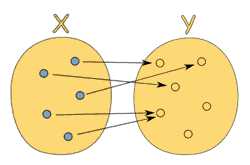

# 八年级数学

根据 mathisfun.com：

> 函数是不同数值之间的特殊关系：每一个输入值返回且只返回一个输出值。

换句话说，函数只是两种数值之间的关系：输入和输出。尽管每个输入都只会有一个输出，但不同的输入却可以有相同的输出。下图展示了一个合法的从 `x` 到 `y` 的函数关系；

（[http://www.mathsisfun.com/sets/function.html）](http://www.mathsisfun.com/sets/function.html）)

相反，下面这张图表展示的就_不是_一种函数关系，因为输入值 `5` 指向了多个输出：

（[http://www.mathsisfun.com/sets/function.html）](http://www.mathsisfun.com/sets/function.html）)

函数可以描述为一个集合，这个集合里的内容是 \(输入, 输出\) 对：`[(1,2), (3,6), (5,10)]`（看起来这个函数是把输入值加倍）。

或者一张表：

| 输入 | 输出 |
| --- | --- | --- | --- |
| 1 | 2 |
| 2 | 4 |
| 3 | 6 |

甚至一个以 `x` 为输入 `y` 为输出的函数曲线图：


如果输入直接指明了输出，那么就没有必要再实现具体的细节了。因为函数仅仅只是输入到输出的映射而已，所以简单地写一个对象就能“运行”它，使用 `[]` 代替 `()` 即可。

```javascript
var toLowerCase = {"A":"a", "B": "b", "C": "c", "D": "d", "E": "e", "D": "d"};

toLowerCase["C"];
//=> "c"

var isPrime = {1:false, 2: true, 3: true, 4: false, 5: true, 6:false};

isPrime[3];
//=> true
```

当然了，实际情况中你可能需要进行一些计算而不是手动指定各项值；不过上例倒是表明了另外一种思考函数的方式。（你可能会想“要是函数有多个参数呢？”。的确，这种情况表明了以数学方式思考问题的一点点不便。暂时我们可以把它们打包放到数组里，或者把 `arguments` 对象看成是输入。等学习 `curry` 的概念之后，你就知道如何直接为函数在数学上的定义建模了。）

戏剧性的是：纯函数_就是_数学上的函数，而且是函数式编程的全部。使用这些纯函数编程能够带来大量的好处，让我们来看一下为何要不遗余力地保留函数的纯粹性的原因。
